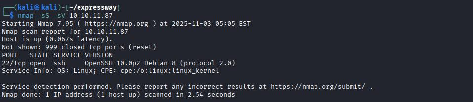
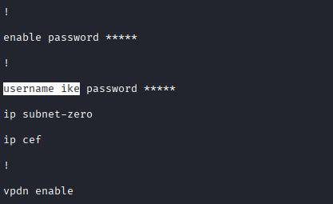
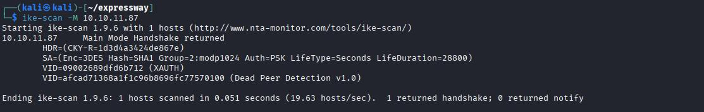
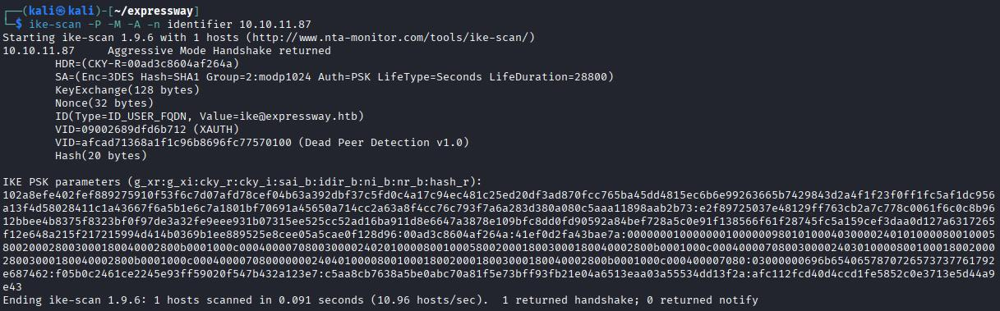
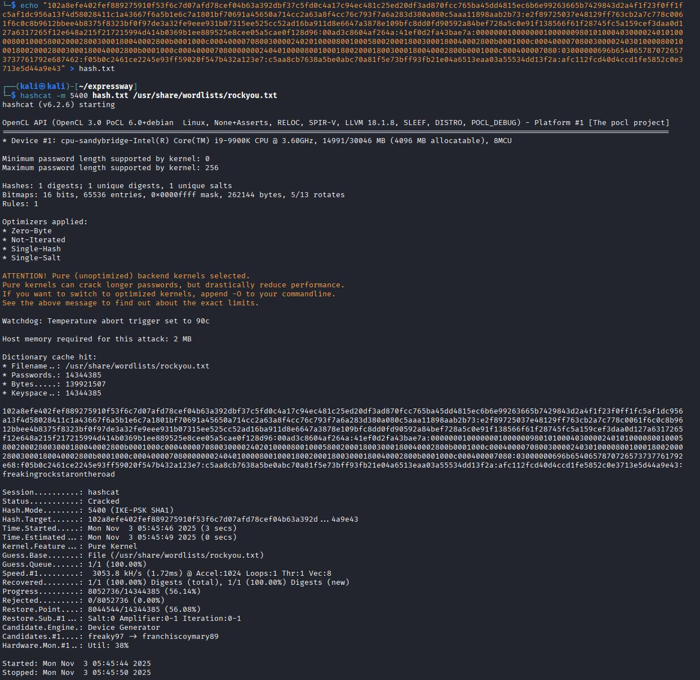
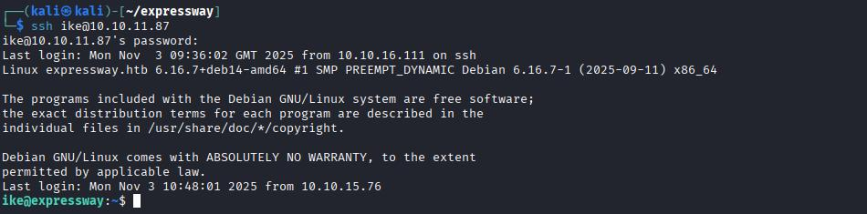
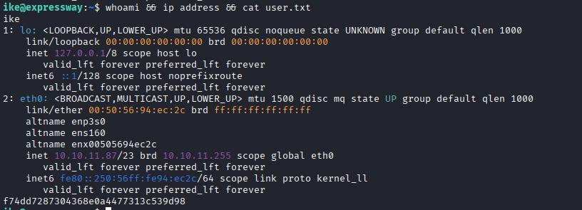

# Summary
Enumeration → TFTP enumeration -> IKE enumeration → credentials → privilege escalation via sudo subdomains.

> **Spoiler warning:** This write-up contains full exploitation steps and proof. Read only if you accept spoilers.

---

We start enumeration with nmap to get open ports:

```bash
nmap -sS -sV 10.10.11.87
```

{ width=600 loading=lazy }

We are only getting SSH port so we proceed to get opened UDP ports:

```bash
nmap -sU -sV -Pn -top-ports 1000 10.10.11.87
```

{ width=600 loading=lazy }

This time we got some interesting ports we can enumerate:

- 69: TFTP port (Trivial file transfer protocol)
- 500: IKE port (Internet key exhange)

We try login to TFTP using tftp tool with no credentials and we connect successfully buy we don't know any file to can download.
Searching in google we found a nmap script to can enumerate TFTP named tftp-enum (https://nmap.org/nsedoc/scripts/tftp-enum.html) and proceed to use it.

```bash
nmap -sU -p 69 --script tftp-enum.nse 10.10.11.87
```

{ width=600 loading=lazy }

We can see a file name ciscortr.cfg so we proceed to login in tftp using tftp tool and get it.

```bash
tftp 10.10.11.87
get ciscortr.cfg
quit
```

Inside we can get an username named ike.

{ width=600 loading=lazy }

Now we have an username but don't have a password so let's go to find it. If we go back to nmap enumeration results we have another port to can enumerate, port 500 (IKE), searching in Google we find the tool ike-scan.

{ width=600 loading=lazy }

With this result we have useful fingerprint that says to us the encryption (SHA1) and the auth (PSK). Using other parameters we get a hash, saving this hash to a new file, using hashcatd with the IKE mode (5400) we get the freakingrockstarontheroad password.

{ width=600 loading=lazy }

{ width=600 loading=lazy }

With the username ike and this password we go to enter in the server using ssh to get the user flag.

{ width=600 loading=lazy }

{ width=600 loading=lazy }


**Disclaimer:** This write-up documents a retired/hypothetical lab. Do not use these techniques against systems you do not own or have explicit permission to test.
