# Summary
Enumeration → Website enumeration -> FTP manipulation -> Get access -> Lateral movement -> Privilege escalation via CVE.

> **Spoiler warning:** This write-up contains full exploitation steps and proof. Read only if you accept spoilers.

---

## Enumeration

We start enumeration with nmap to get open ports:

```bash
nmap -sS -sV 10.10.11.86
```

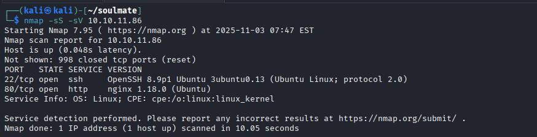{ width=600 loading=lazy }

There are 2 ports open, SSH (22) and HTTP (80).

In first place, we executes whatweb tool to know more about this website. The result indicate us that the website has the soulmate.htb hostname, so we edit the hosts file to include it.

```bash
whatweb 10.10.11.86
```

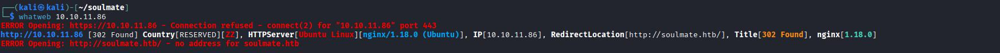{ width=600 loading=lazy }

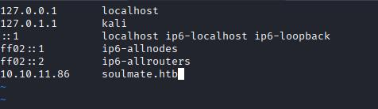{ width=600 loading=lazy }

Visiting the website we find a login page and a register page, we creates an user but the profile page doesn't give us nothing more interesting to exploit.

{ width=600 loading=lazy }

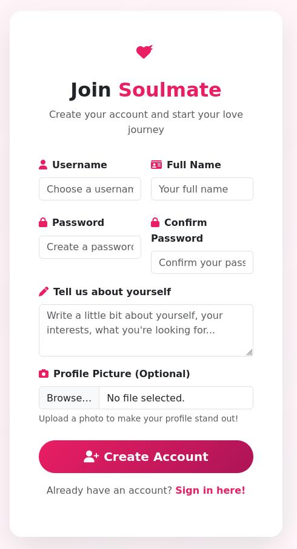{ width=600 loading=lazy }

We proceed to check more things about the website, sections, subdomains, wordpress etc...

### Sections
```bash
wfuzz -c -z file,/usr/share/wfuzz/wordlist/general/common.txt --hc 404 http://soulmate.htb/FUZZ 
```

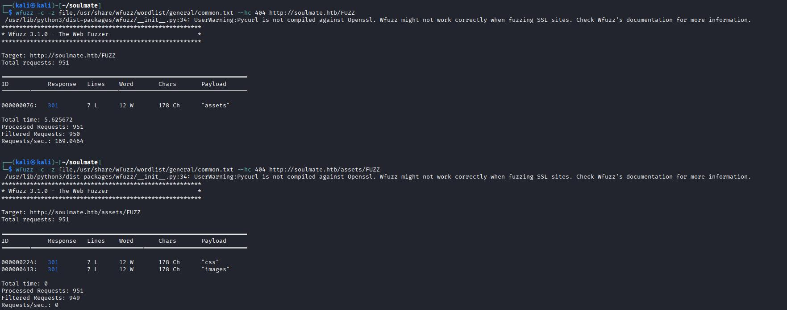{ width=600 loading=lazy }

### Wordpress
```bash
wpscan --url http://soulmate.htb   
```

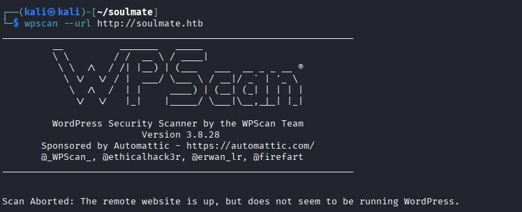{ width=600 loading=lazy }

### Directories
```bash
dirsearch -u http://soulmate.htb  
```

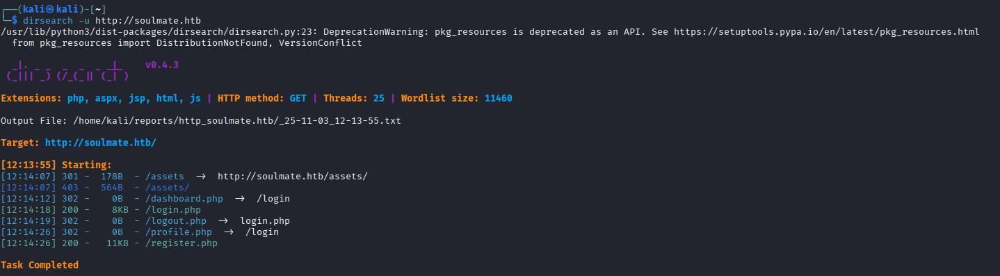{ width=600 loading=lazy }

### Subdomains
```bash
ffuf -u 'http://soulmate.htb/' -H 'Host: FUZZ.soulmate.htb' -w /usr/share/wordlists/subdomains-top1million-5000.txt -fw 4  
```

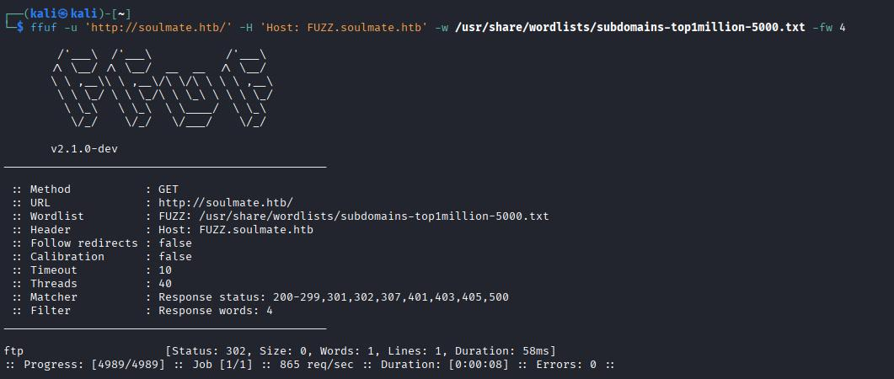{ width=600 loading=lazy }

Only in the subdomains enumerations we find something interesting, ftp subdomain, so we proceed to add to hosts file and to check it out.

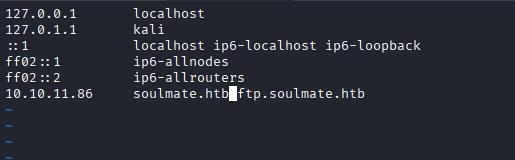{ width=600 loading=lazy }

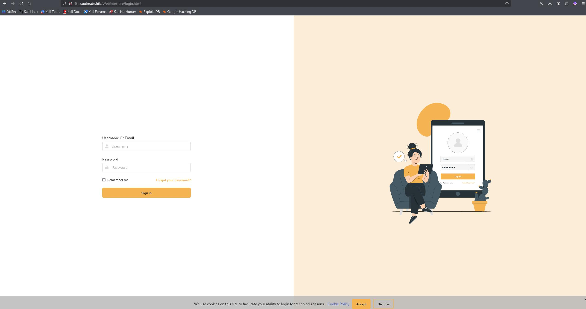{ width=600 loading=lazy }

We checks the web searching for a version number but we can't find it, so search in google about the product 'CrushFTP' and gets some CVE's. After try with some of that we try the CVE-2025-31161 exploit and get's an username and a password.

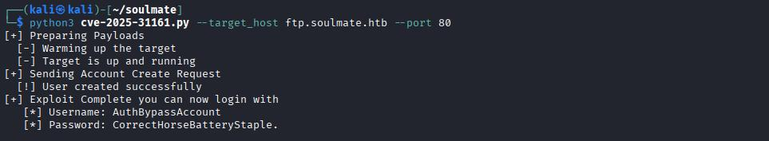{ width=600 loading=lazy }

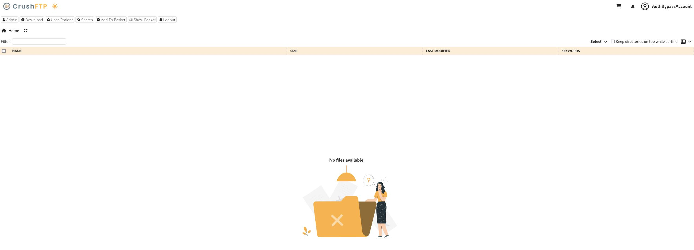{ width=600 loading=lazy }

Checking the FTP website we find a section where we can change the users passwords so we changed the 'ben' password because this user has the capabilities of change the soulmate web files.

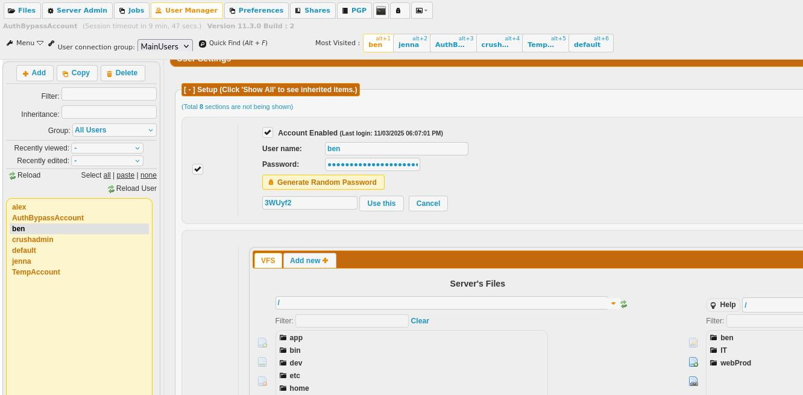{ width=600 loading=lazy }

Once we logged in with this user, we upload a reverse shell named payload.php and get a shell with www-data user.

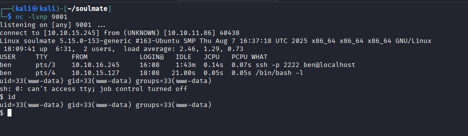{ width=600 loading=lazy }

Now we got access with www-data user, once reviewed typical things like sudo, SID, linpeas etc. and can't find anything we go to execute pspy64 to check if any process is executing with other user (ben) or root.

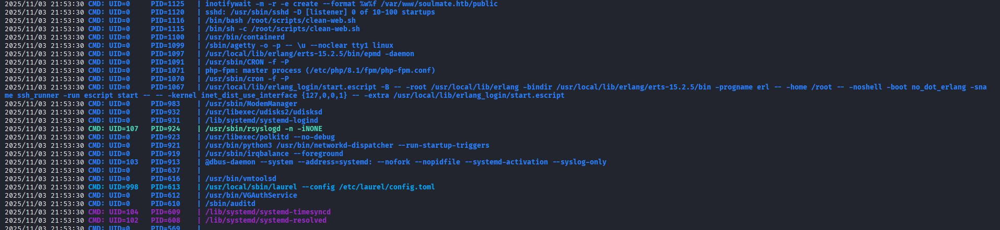{ width=600 loading=lazy }

We can see a process (erlang_login/start.escript) executing with root. We go to check this folder.

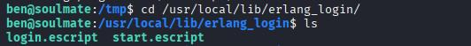{ width=600 loading=lazy }

Checking start.escript file we can see ben password inside.

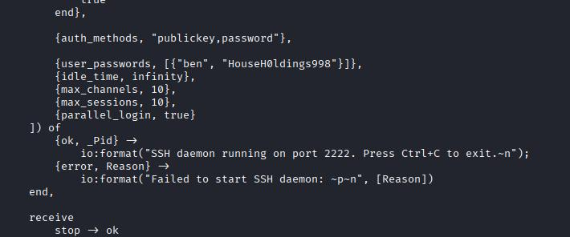{ width=600 loading=lazy }

Loggin in with ben user via SSH we can get the user flag.

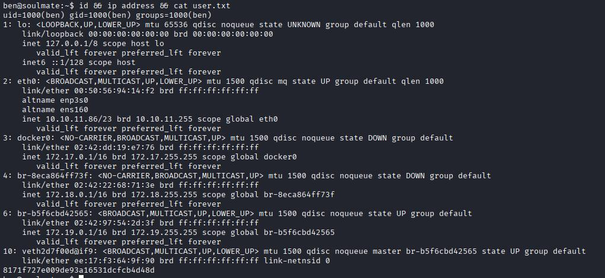{ width=600 loading=lazy }


## Privilege escalation

Checking start.escript file we can see something about a SSH daemon in port 2222.

If we execute netcat to localhost on port 2222 we can see the fingerprint 'SSH-2.0-Erlang/5.2.9'.

Checking in google about this version of SSH erlang we can see a CVE (CVE-2025-32433) and an exploit script.

We download the script from URL (https://raw.githubusercontent.com/omer-efe-curkus/CVE-2025-32433-Erlang-OTP-SSH-RCE-PoC/refs/heads/main/cve-2025-32433.py) and creates a python server to can download in server.

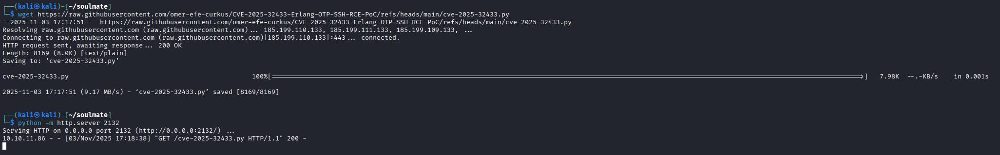{ width=600 loading=lazy }


Once downloaded in server we run a netcat in our machine and executes the script.

```bash
nc -lvnp 9911
```

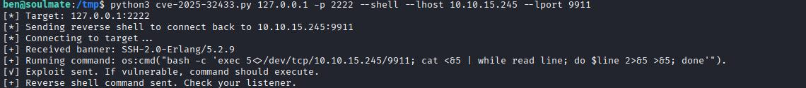{ width=600 loading=lazy }

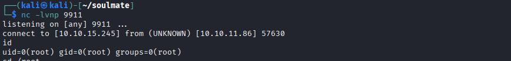{ width=600 loading=lazy }

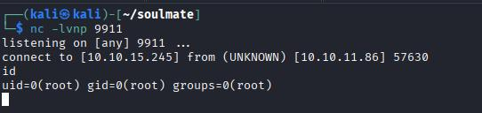{ width=600 loading=lazy }

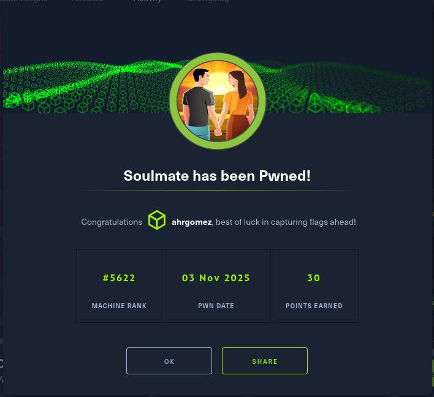{ width=600 loading=lazy }

**Disclaimer:** This write-up documents a retired/hypothetical lab. Do not use these techniques against systems you do not own or have explicit permission to test.
